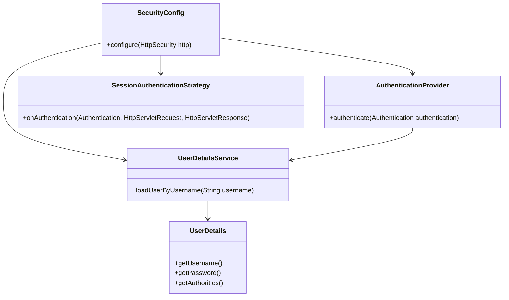
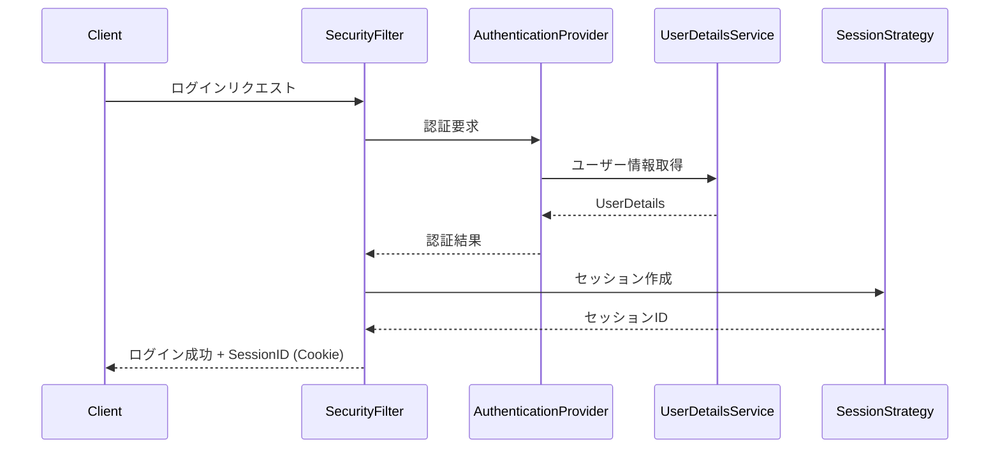
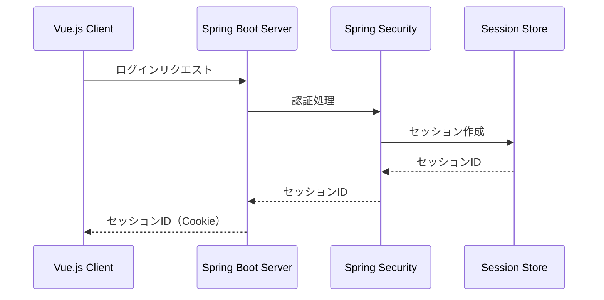
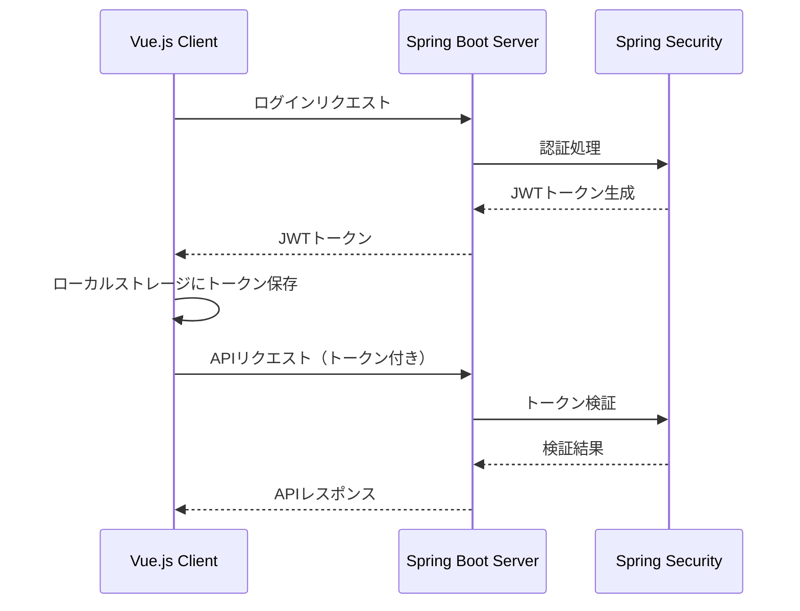
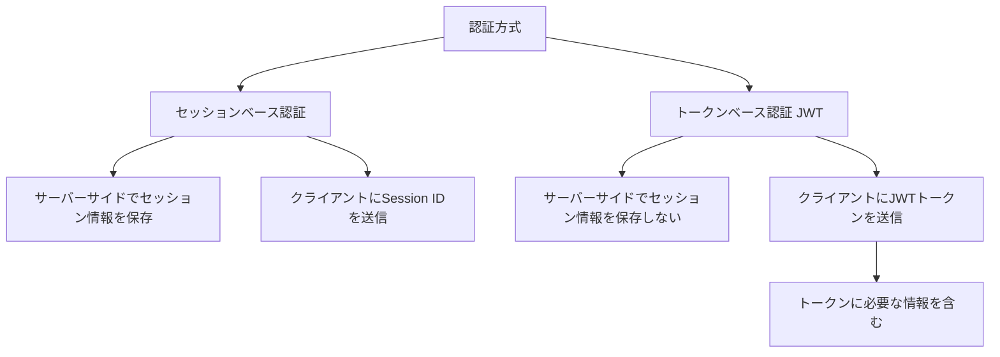

# Memo
## Link list
* [Full-stack Spring Boot + Vue.js:CRUD example (一番網羅的に書いてある記事。)](https://www.bezkoder.com/spring-boot-vue-js-crud-example/)
* [Vue+SpringでSPA作成14[Create・Upadate・Delete処理]](https://techhotoke.hatenablog.com/entry/2022/02/27/010612)
* [Spring Boot + Vue.js:Authentication with JWT & Spring Security Example(アーキテクチャのイメージ図)](https://www.bezkoder.com/spring-boot-vue-js-authentication-jwt-spring-security/)
* [Restful APIについて（そもそもRestfulAPIってなんなん？ってところに踏み込んでる。）](https://qiita.com/mayu_w1223/items/43508b86cbccc1564734)

主な認証方式にはセッションベース認証とJWT認証の2種類がある。違いは以下の通り。
セッションベース認証
・送受信する情報はSessionIDのみ。
・サーバー側でSessionと紐づけされた情報を持っている必要がある。
・リクエスト時にCookieとして送信される。
・リクエストを受けると、サーバー側はSessionIDと紐づけされた情報を基に、アカウントと権限を確認し処理を行う。

JWT認証
・送受信する情報はJWTトークン。トークンには、アカウントIDや権限などの情報を含む
・サーバー側は、セッション情報を保持しない。
・リクエストが来たときに、そのトークンが保持しているアカウントIDや権限を基に処理を行う。
・リクエストにCookieとは違う形でHeaderにつけて送信される

sessionベース

JWTトークン認証

