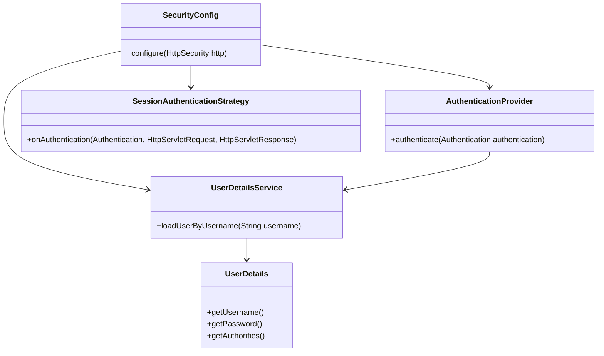
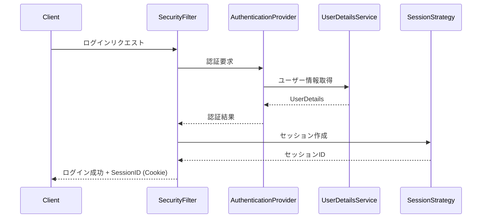

[Vue側の認証時の画面遷移について](https://qiita.com/yatsurugi55/items/c867131016e37e71ee04)
[Spring security with Spring boot2.0 rest API](https://qiita.com/rubytomato@github/items/6c6318c948398fa62275)
[spring security 6.0 を初めて学ぶ人のために](https://www.docswell.com/s/MasatoshiTada/KGVY9K-spring-security-intro#p2)
[Spring security API login](https://kasyalog.site/blog/spring-security-api-auth/)
[spring framwwork　入門](https://qiita.com/suke_masa/items/9dd3300c3190d6445ff8)
Spring Security 6を使用してSession認証を実装する場合の全体的な流れと必要なクラスについて説明します。

1. 主要なクラスと関係



2. 主要なクラスの説明

- SecurityConfig: Spring Securityの設定を行うクラス
- UserDetailsService: ユーザー情報を取得するためのサービス
- UserDetails: ユーザー情報を表すインターフェース
- AuthenticationProvider: 認証ロジックを提供するクラス
- SessionAuthenticationStrategy: セッション管理戦略を定義するインターフェース

3. 実装の流れ

a. SecurityConfig の実装:

```java
@Configuration
@EnableWebSecurity
public class SecurityConfig {

    @Autowired
    private UserDetailsService userDetailsService;

    @Bean
    public SecurityFilterChain filterChain(HttpSecurity http) throws Exception {
        http
            .authorizeHttpRequests(authz -> authz
                .requestMatchers("/public/**").permitAll()
                .anyRequest().authenticated()
            )
            .formLogin(form -> form
                .loginPage("/login")
                .permitAll()
            )
            .sessionManagement(session -> session
                .sessionCreationPolicy(SessionCreationPolicy.IF_REQUIRED)
                .maximumSessions(1)
            );
        return http.build();
    }

    @Bean
    public AuthenticationProvider authenticationProvider() {
        DaoAuthenticationProvider provider = new DaoAuthenticationProvider();
        provider.setUserDetailsService(userDetailsService);
        provider.setPasswordEncoder(passwordEncoder());
        return provider;
    }

    @Bean
    public PasswordEncoder passwordEncoder() {
        return new BCryptPasswordEncoder();
    }
}
```

b. UserDetailsService の実装:

```java
@Service
public class CustomUserDetailsService implements UserDetailsService {

    @Autowired
    private UserRepository userRepository;

    @Override
    public UserDetails loadUserByUsername(String username) throws UsernameNotFoundException {
        User user = userRepository.findByUsername(username)
            .orElseThrow(() -> new UsernameNotFoundException("User not found"));

        return new org.springframework.security.core.userdetails.User(
            user.getUsername(),
            user.getPassword(),
            user.getAuthorities()
        );
    }
}
```

c. User エンティティの実装:

```java
@Entity
public class User implements UserDetails {
    @Id
    @GeneratedValue(strategy = GenerationType.IDENTITY)
    private Long id;

    private String username;
    private String password;

    @ElementCollection(fetch = FetchType.EAGER)
    private List<String> roles;

    // UserDetails インターフェースのメソッド実装
    // getUsername(), getPassword(), getAuthorities() など
}
```

4. 認証フロー



5. セッション管理

- セッションの有効期限、同時ログイン制限、セッションの固定化保護などはSecurityConfigで設定できます。
- セッションIDは自動的に生成され、Cookieとしてクライアントに送信されます。

6. ログアウト処理

```java
http.logout(logout -> logout
    .logoutUrl("/logout")
    .logoutSuccessUrl("/login?logout")
    .invalidateHttpSession(true)
    .deleteCookies("JSESSIONID")
);
```

このような形で、Spring Security 6を使用してSession認証を実装できます。主要なコンポーネントはSecurityConfig、UserDetailsService、およびUserエンティティです。これらを適切に設定することで、セキュアなセッションベースの認証システムを構築できます。

実際の実装では、ビジネスロジックやデータベース連携、エラーハンドリングなども考慮する必要があります。また、具体的な要件に応じて、さらに詳細な設定やカスタマイズが必要になる場合もあります。

はい、Entityを実装せずにBeanのみを実装することは可能です。これは特に、データベースを直接使用せず、他のデータソース（例：外部API、インメモリストレージ、ファイルシステムなど）を利用する場合や、単純なアプリケーションで複雑なORMが不要な場合に適しています。

以下に、Entityを使用せずにBeanのみを使用する例を示します：

1. ユーザーBeanの定義:

```java
public class User implements UserDetails {
    private String id;
    private String username;
    private String password;
    private Set<String> roles;

    // コンストラクタ、ゲッター、セッター

    @Override
    public Collection<? extends GrantedAuthority> getAuthorities() {
        return roles.stream()
                .map(role -> new SimpleGrantedAuthority("ROLE_" + role))
                .collect(Collectors.toList());
    }

    @Override
    public boolean isAccountNonExpired() {
        return true;
    }

    @Override
    public boolean isAccountNonLocked() {
        return true;
    }

    @Override
    public boolean isCredentialsNonExpired() {
        return true;
    }

    @Override
    public boolean isEnabled() {
        return true;
    }
}
```

2. ユーザーリポジトリの実装（データベースの代わりにインメモリストレージを使用）:

```java
@Repository
public class UserRepository {
    private final Map<String, User> users = new ConcurrentHashMap<>();

    public Optional<User> findByUsername(String username) {
        return Optional.ofNullable(users.get(username));
    }

    public void save(User user) {
        users.put(user.getUsername(), user);
    }

    // その他の必要なメソッド
}
```

3. UserDetailsServiceの実装:

```java
@Service
public class CustomUserDetailsService implements UserDetailsService {

    private final UserRepository userRepository;

    @Autowired
    public CustomUserDetailsService(UserRepository userRepository) {
        this.userRepository = userRepository;
    }

    @Override
    public UserDetails loadUserByUsername(String username) throws UsernameNotFoundException {
        return userRepository.findByUsername(username)
                .orElseThrow(() -> new UsernameNotFoundException("User not found: " + username));
    }
}
```

4. SecurityConfigの設定（変更なし）:

```java
@Configuration
@EnableWebSecurity
public class SecurityConfig {

    private final CustomUserDetailsService userDetailsService;

    @Autowired
    public SecurityConfig(CustomUserDetailsService userDetailsService) {
        this.userDetailsService = userDetailsService;
    }

    @Bean
    public SecurityFilterChain filterChain(HttpSecurity http) throws Exception {
        http
            .authorizeHttpRequests(authz -> authz
                .requestMatchers("/public/**").permitAll()
                .anyRequest().authenticated()
            )
            .formLogin(form -> form
                .loginPage("/login")
                .permitAll()
            )
            .userDetailsService(userDetailsService);

        return http.build();
    }

    @Bean
    public PasswordEncoder passwordEncoder() {
        return new BCryptPasswordEncoder();
    }
}
```

このアプローチの利点:
1. シンプルな構造: データベース関連の複雑さを排除できます。
2. 柔軟性: データソースを簡単に変更できます（例：インメモリからRedisやMongoDBへの移行）。
3. テストの容易さ: モックオブジェクトの作成が簡単です。

注意点:
1. スケーラビリティ: 大規模なデータセットや複雑なクエリには適していません。
2. 永続性: アプリケーションの再起動時にデータが失われます（この例ではインメモリストレージを使用しているため）。
3. トランザクション管理: データベースを使用しない場合、トランザクション管理が複雑になる可能性があります。

結論として、Entityを実装せずにBeanのみを使用することは可能であり、特定のユースケースでは適切な選択となります。ただし、アプリケーションの要件、規模、および将来の成長を考慮して、適切なアプローチを選択することが重要です。


はい、その条件で実装することは可能です。この方法では、JPA/Hibernate などの ORM を使わず、直接 SQL を扱う DAO (Data Access Object) パターンを使用します。以下に、その実装例を示します。

1. User Bean:

```java
public class User implements UserDetails {
    private Long id;
    private String username;
    private String password;
    private Set<String> roles;

    // コンストラクタ、ゲッター、セッター

    @Override
    public Collection<? extends GrantedAuthority> getAuthorities() {
        return roles.stream()
                .map(role -> new SimpleGrantedAuthority("ROLE_" + role))
                .collect(Collectors.toList());
    }

    // UserDetails の他のメソッドの実装
    // isAccountNonExpired(), isAccountNonLocked(), isCredentialsNonExpired(), isEnabled()
}
```

2. UserDAO インターフェース:

```java
public interface UserDAO {
    Optional<User> findByUsername(String username);
    void save(User user);
    // 他の必要なメソッド
}
```

3. UserDAO 実装:

```java
@Repository
public class UserDAOImpl implements UserDAO {
    private final JdbcTemplate jdbcTemplate;

    @Autowired
    public UserDAOImpl(JdbcTemplate jdbcTemplate) {
        this.jdbcTemplate = jdbcTemplate;
    }

    @Override
    public Optional<User> findByUsername(String username) {
        String sql = "SELECT * FROM users WHERE username = ?";
        try {
            User user = jdbcTemplate.queryForObject(sql, new Object[]{username}, (rs, rowNum) -> {
                User u = new User();
                u.setId(rs.getLong("id"));
                u.setUsername(rs.getString("username"));
                u.setPassword(rs.getString("password"));
                u.setRoles(getRolesForUser(rs.getLong("id")));
                return u;
            });
            return Optional.ofNullable(user);
        } catch (EmptyResultDataAccessException e) {
            return Optional.empty();
        }
    }

    private Set<String> getRolesForUser(Long userId) {
        String sql = "SELECT role FROM user_roles WHERE user_id = ?";
        return new HashSet<>(jdbcTemplate.queryForList(sql, String.class, userId));
    }

    @Override
    public void save(User user) {
        String sql = "INSERT INTO users (username, password) VALUES (?, ?)";
        KeyHolder keyHolder = new GeneratedKeyHolder();
        jdbcTemplate.update(connection -> {
            PreparedStatement ps = connection.prepareStatement(sql, Statement.RETURN_GENERATED_KEYS);
            ps.setString(1, user.getUsername());
            ps.setString(2, user.getPassword());
            return ps;
        }, keyHolder);

        long userId = keyHolder.getKey().longValue();
        saveRoles(userId, user.getAuthorities());
    }

    private void saveRoles(long userId, Collection<? extends GrantedAuthority> authorities) {
        String sql = "INSERT INTO user_roles (user_id, role) VALUES (?, ?)";
        for (GrantedAuthority authority : authorities) {
            jdbcTemplate.update(sql, userId, authority.getAuthority().replace("ROLE_", ""));
        }
    }
}
```

4. UserDetailsService 実装:

```java
@Service
public class CustomUserDetailsService implements UserDetailsService {

    private final UserDAO userDAO;

    @Autowired
    public CustomUserDetailsService(UserDAO userDAO) {
        this.userDAO = userDAO;
    }

    @Override
    public UserDetails loadUserByUsername(String username) throws UsernameNotFoundException {
        return userDAO.findByUsername(username)
                .orElseThrow(() -> new UsernameNotFoundException("User not found: " + username));
    }
}
```

5. Controller 例:

```java
@RestController
@RequestMapping("/api/users")
public class UserController {

    private final UserDAO userDAO;
    private final PasswordEncoder passwordEncoder;

    @Autowired
    public UserController(UserDAO userDAO, PasswordEncoder passwordEncoder) {
        this.userDAO = userDAO;
        this.passwordEncoder = passwordEncoder;
    }

    @PostMapping("/register")
    public ResponseEntity<?> registerUser(@RequestBody User user) {
        user.setPassword(passwordEncoder.encode(user.getPassword()));
        userDAO.save(user);
        return ResponseEntity.ok("User registered successfully");
    }

    // 他のエンドポイント
}
```

6. SecurityConfig（変更なし）:

```java
@Configuration
@EnableWebSecurity
public class SecurityConfig {

    private final CustomUserDetailsService userDetailsService;

    @Autowired
    public SecurityConfig(CustomUserDetailsService userDetailsService) {
        this.userDetailsService = userDetailsService;
    }

    @Bean
    public SecurityFilterChain filterChain(HttpSecurity http) throws Exception {
        http
            .authorizeHttpRequests(authz -> authz
                .requestMatchers("/public/**", "/api/users/register").permitAll()
                .anyRequest().authenticated()
            )
            .formLogin(form -> form
                .loginPage("/login")
                .permitAll()
            )
            .userDetailsService(userDetailsService);

        return http.build();
    }

    @Bean
    public PasswordEncoder passwordEncoder() {
        return new BCryptPasswordEncoder();
    }
}
```

7. データベース設定 (application.properties):

```properties
spring.datasource.url=jdbc:postgresql://localhost:5432/your_database
spring.datasource.username=your_username
spring.datasource.password=your_password
spring.datasource.driver-class-name=org.postgresql.Driver
```

この実装では:

1. Bean のみを使用し、Entity は使用していません。
2. ユーザー情報は PostgreSQL に保存されます。
3. DB とのやり取りは Controller → DAO → DB の流れで行われます。
4. JdbcTemplate を使用して直接 SQL を実行しています。

注意点:
- エラーハンドリングやトランザクション管理を適切に行う必要があります。
- セキュリティ対策（SQLインジェクション対策など）に注意が必要です。
- 大規模なアプリケーションの場合、この方法はメンテナンスが難しくなる可能性があります。

この方法は、ORM を使用せずに直接データベースを操作したい場合や、既存のレガシーシステムとの統合が必要な場合に適しています。ただし、アプリケーションの規模や要件に応じて、適切なアプローチを選択することが重要です。

大変良い質問です。実は、先ほど提示したコードには明示的なパスワード認証のロジックが含まれていませんでした。これは重要な見落としでした。Spring Securityのデフォルトの動作に依存していたため、明示的な実装が必要でした。

パスワードの認証を適切に行うには、カスタムの`AuthenticationProvider`を実装する必要があります。以下に、パスワード認証を含む修正版の実装を示します：

1. カスタム`AuthenticationProvider`の実装:

```java
@Component
public class CustomAuthenticationProvider implements AuthenticationProvider {

    private final UserDAO userDAO;
    private final PasswordEncoder passwordEncoder;

    @Autowired
    public CustomAuthenticationProvider(UserDAO userDAO, PasswordEncoder passwordEncoder) {
        this.userDAO = userDAO;
        this.passwordEncoder = passwordEncoder;
    }

    @Override
    public Authentication authenticate(Authentication authentication) throws AuthenticationException {
        String username = authentication.getName();
        String password = authentication.getCredentials().toString();

        Optional<User> userOptional = userDAO.findByUsername(username);

        if (userOptional.isPresent()) {
            User user = userOptional.get();
            if (passwordEncoder.matches(password, user.getPassword())) {
                return new UsernamePasswordAuthenticationToken(username, password, user.getAuthorities());
            }
        }

        throw new BadCredentialsException("Authentication failed");
    }

    @Override
    public boolean supports(Class<?> authentication) {
        return authentication.equals(UsernamePasswordAuthenticationToken.class);
    }
}
```

2. `SecurityConfig`の修正:

```java
@Configuration
@EnableWebSecurity
public class SecurityConfig {

    private final CustomAuthenticationProvider authenticationProvider;

    @Autowired
    public SecurityConfig(CustomAuthenticationProvider authenticationProvider) {
        this.authenticationProvider = authenticationProvider;
    }

    @Bean
    public SecurityFilterChain filterChain(HttpSecurity http) throws Exception {
        http
            .authorizeHttpRequests(authz -> authz
                .requestMatchers("/public/**", "/api/users/register").permitAll()
                .anyRequest().authenticated()
            )
            .formLogin(form -> form
                .loginPage("/login")
                .permitAll()
            )
            .authenticationProvider(authenticationProvider);

        return http.build();
    }

    @Bean
    public PasswordEncoder passwordEncoder() {
        return new BCryptPasswordEncoder();
    }
}
```

この修正により：

1. `CustomAuthenticationProvider`クラスで実際のパスワード認証が行われます。
2. `UserDAO`を使用してデータベースからユーザー情報を取得します。
3. `PasswordEncoder`を使用して、入力されたパスワードとデータベースに保存されているハッシュ化されたパスワードを比較します。
4. 認証が成功した場合、適切な`Authentication`オブジェクトを返します。
5. 認証が失敗した場合、`BadCredentialsException`をスローします。

`SecurityConfig`クラスでは、このカスタム`AuthenticationProvider`を設定に追加しています。これにより、Spring Securityはログイン試行時にこのプロバイダーを使用してユーザーを認証します。

この実装により、パスワードの認証はデータベースに保存されているユーザー情報と照合して行われ、セキュアな認証プロセスが確保されます。また、この方法はBeanのみを使用し、Controller → DAO → DBの流れを維持しています。

